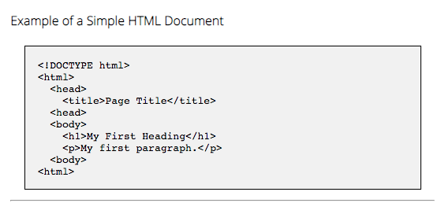
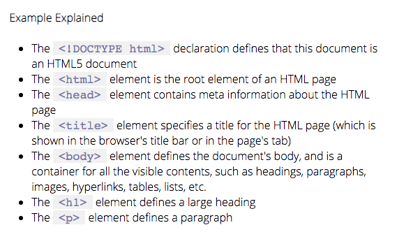
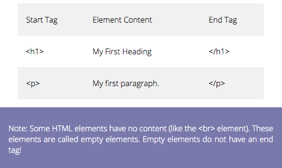

# HTML Technical Document   

### Checkout the Live Version of the [Project](https://dcc5235.github.io/Coffee_Survey/)!

**HTML5, CSS3**

A mobile-first approach to a responsive, technical documentation page built with clickable navbar elements, so that users are brought to the corresponding section of the main. There are viewable code examples for users to review.

---

## Project Highlights

Project Section | Features
------------ | -------------
[Navigation](#Navigation) | Responsive hamburger navigation at mobile view, and vertical navbar at desktop view.
[Main: Code Tag](#Main1) | Code elements allow users to review example codes.
[Main: Span Tag](#Main2) | Span elements allow specific text to be styled in relation to example codes.
[Main: Table Tag](#Main3) | Table elements allow users to view table examples where every other row is defined by a different color.

## Navigation

## Main1

## Main2

## Main3

---

## Contributors

Dany Chheang dany.chheang@gmail.com
